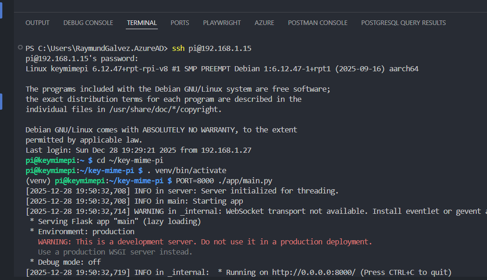

## Starting Key Mime Pi



```js

https://mtlynch.io/key-mime-pi/

1. PS C:\Users\RaymundGalvez.AzureAD> ssh pi@192.168.1.15
2. pi@192.168.1.15's password:
//ps...23

 //Linux keymimepi 6.12.47+rpt-rpi-v8 #1 SMP PREEMPT Debian 1:6.12.47-1+rpt1 (2025-09-16) aarch64
//Last login: Sun Dec 28 19:29:21 2025 from 192.168.1.27 

3. pi@keymimepi:~ $ cd ~/key-mime-pi
4. pi@keymimepi:~/key-mime-pi $ . venv/bin/activate
5. (venv) pi@keymimepi:~/key-mime-pi $ PORT=8000 ./app/main.py

 /* Serving Flask app "main" (lazy loading)
 always use FIREFOX
 http://192.168.1.15:8000/
 * Environment: production
   WARNING: This is a development server. Do not use it in a production deployment.
   Use a production WSGI server instead.
 * Debug mode: off */

6. (venv) pi@keymimepi:~/key-mime-pi $ sudo shutdown -h now

```